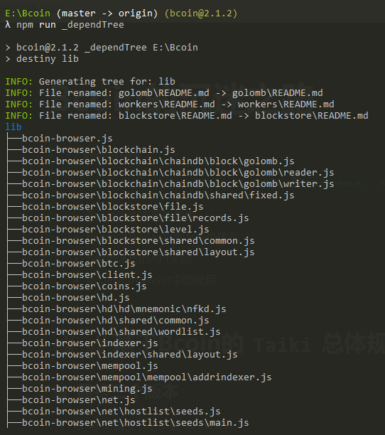
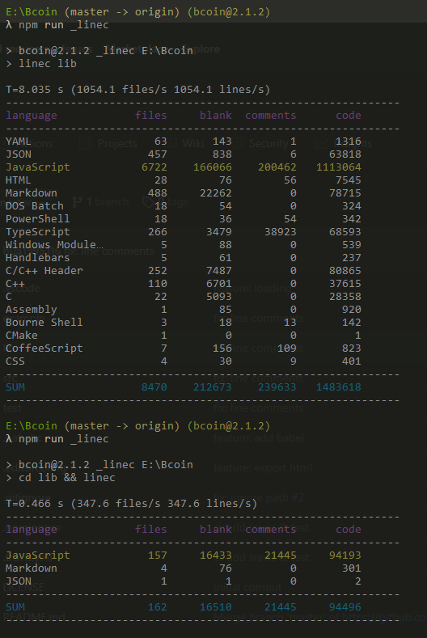
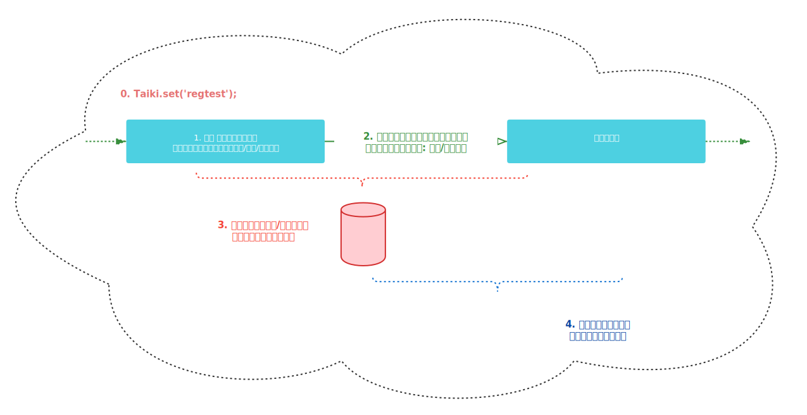
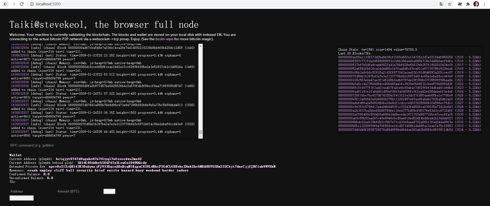

# Demo (Bcoin的底层解析)
:::tip Reference
  💋`done`、❄️`todo`、🐌`doing`、❌`fail`、📝`reference`、✂️`cancel`
- [Bcoin功能流程依赖图](https://www.processon.com/diagraming/5fa3cc56e0b34d7a1a9803d3)
- [Bcoin内在核心机制&事件体系](https://bcoin.io/guides/events.html)
- [Bcion详尽的API文档](https://bcoin.io/api-docs/index.html#bcoin-client-requests)
- [Bcoin在Browser中的使用](https://bcoin.io/guides/browser)
:::


```diff title="test"
- a
+ b
```


## 🐌🐌基于Bcoin的 `Taiki` 总体规划路线🐌🐌
### 👋🏻 最终三个版本
  - ❄️ 移动端全节点(B版-browser)
  - ❄️ 桌面版全节点(N版-node)
  - ❄️ 轻量级移动端&全节点后端(CS版-client/server)

### 🍓 Browser端运行单体bcoin
  - 💋 已经成功打包成单体应用: Taiki.js (依赖bpkg,并在挂载全局对象 global.Taiki)
  - 💋 已经成功运行(以创建测试网的区块链和交易池为例) [✏️](#1)

### 🍋 Browser端支持wsProxy,监听并响应链上事件
  - 💋 实现代理服务器的功能(并详细阐述了代理服务器server, wsProxy等的具体实现) [✏️](#1)

### ⚽ NodeJS端/Browser端运行examples
  > 先NodeJS端，再Browser端

  - ❄️ `fullnode`: 创建一个全节点对象并连接到`testnet`  [✏️](#1)
  - ❄️ `connetc-to-peer`: 在`regtest`模式下连接到用户定义的节点 [✏️](#1)
  - ❄️ `connect-to-the-p2p-net`: 创建`chain`、`pool`、`mempool`对象用于主网和测试网 [✏️](#1)
  - 💋 `create-a-blockchian-and-mempool`: 创建一条链和交易池, 然后创建矿工并挖一个区块缀连到链尾[✏️](#1)
  - ❄️ `wallet`: 添加一个`dummy`交易到钱包，触发`tx`事件的处理 [✏️](#1)
  - ❄️ `spv-sync-wallet`: 由一个最小全节点，将符合SPV节点布隆过滤器的交易广播到SPV节点 [✏️](#1)
  - ❄️ `peer-plugin`: 演示bcoin的`node`对象的`plugin`特性 [✏️](#1)
  - ❄️ `client-api`: 演示`node`和`wallet`的api的使用  [✏️](#1)
  - ❄️ `create-sign-tx`: 创建签名交易: 使用`mtx`和`keystring`模块来签名一笔交易  [✏️](#1)
  - ❄️ `get-tx-from-chain`: 获取链上的交易: 连接到实时测试网来同步前1000个区块，并启用tx索引 [✏️](#1)
  - ❄️ `watch-only-wallet`: 将一个`xpub`导入一个新的可以派生地址的手表专用钱包 [✏️](#1)

  - ❄️ 用react实现简易前端: 功能页面和对应的逻辑模块，隶属同一组件
  - ❄️ docs/examples中所有示例，拆分成可嵌入的模块

### 🍑 试用并集成接口和核心功能
  > 根据官方核心机制，API，Events把玩各个接口和功能，完整的写在example-demo.html中。[查看](https://bcoin.io/guides.html)

  - ❄️ 交易操作：使用bcoin和MTX,TX对象进行交易操作; [✏️](#1)
  - ❄️ 构建Web应用：使用bcoin库中的各个模块来构建Web应用程序; [✏️](#1)
  - ❄️ 钱包账户钥匙：使用bcoin创建和使用钱包 [✏️](#1)
  - ❄️ 跨链原子交易：使用bcoin和bcash库，在两条链上的两个用户之间执行币的交换。创建一个哈希时间锁合约来安全的执行交易; [✏️](#1)
  - ❄️ 隔离见证：隔离见证和bcoin的配合使用; [✏️](#1)
  - ❄️ 区块链上存储数据：创建一个交易，其输出包含一个空数据脚本; [✏️](#1)
  - ❄️ 创建多重签名交易：使用内置的bcoin组件和钱包api来创建和处理多重签名交易; [✏️](#1)
  - ❄️ 命令行中多重签名： [✏️](#1)
  - ❄️ 生成地址：使用内置的bcoin组件从0开始构建交易; [✏️](#1)
  - ❄️ 事件和sockets：所有事件的清单，哪些函数调用他们，它们又返回哪些数据，哪些对象捕获并重新触发它们，及通过websocket连接可以使用哪些事件; [✏️](#1)
  - ❄️ 创建一个众筹交易：通过构建自定义的众筹交易，让任何人将自己的输入添加到具有固定输出的交易中，来了解SIGHASH标志在比特币中的工作方式; [✏️](#1)
  - ❄️ 连接两个本地节点：在单个脚本中启动并手动连接两个regtest节点; [✏️](#1)
  - ❄️ 事件锁定的比特币交易：了解如何使用带有bcoin的比特币脚本进行和赎回时间锁定交易。将提供一个函数来创建一个脚本，该脚本在预定的时间内锁定UTXO，并分别学习如何对这些类型的特殊输入进行签名; [✏️](#1)
  - ❄️ 构建很棒的bcoin插件：通过构建bcoin插件来扩展功能; [✏️](#1)
  - ❄️ 在浏览器中运行bcoin全节点：通过使用一个代理服务器，我们能将客户端连接到真实的比特币网络; [✏️](#1)

  > 真的必须要一个代理服务器吗? 虽然说基于安全考虑，浏览器不允许在脚本中向别的服务器创建TCP连接。
  - ❄️ 在树莓派等linux设备上运行bcoin：运行bcoin节点并使用尽可能少的资源尽快与比特币网络进行交互。

### 🍇 基于React设计区块应用的精美页面
  > 设计一些页面(React，可参考一些比特币/区块链应用的优秀页面)，利用Bcoin的一些接口完成一些功能

  - 📝 参考对象: Blockchain, Polkawallet, Wallet, Status, MetaMask, 麦子钱包, BFChain等App
  - 📝 参考网站: [比特币数据可视化](https://bitcoinvisuals.com/), [实时状态的展示](https://mempool.space/zh/)等

### 🌽 支持自由拔插的共识协议
  > 改造该Bcoin，使之能用在BFT上的共识协议上；（可插拔的共识协议...DPOS,DPOP等）

### 🍆 初版的移动端安全聊天/点对点转账/交易上链的应用(RN)
  > 基于ReactNative + Telegram + Wallet + Status做一款移动端安全聊天+点对点转账+交易上链的应用

  - 💋 基于ReactNative的Taiki的架构搭建编译安装发布等流程

### 🏆 高阶版Taiki(Ton)
  > 将Bcoin改造成TON白皮书的那种设想（Telegram + Wallet + 工作链/分片链，需要参考TON的C++源码）


## 🌊🌊Bcoin源码的顶层架构🌊🌊

```yaml
.
├── bcoin-browser.js
├── bcoin.js
├── blockchain
│ ├── chaindb.js
│ ├── chainentry.js
│ ├── chain.js
│ ├── common.js
│ ├── index.js
│ └── layout.js
├── blockstore
│ ├── abstract.js
│ ├── common.js
│ ├── file.js
│ ├── index.js
│ ├── layout.js
│ ├── level.js
│ ├── README.md
│ └── records.js
├── btc
│ ├── amount.js
│ ├── index.js
│ └── uri.js
├── client
│ ├── index.js
│ ├── node.js
│ └── wallet.js
├── coins
│ ├── coinentry.js
│ ├── coins.js
│ ├── coinview.js
│ ├── compress.js
│ ├── index.js
│ └── undocoins.js
├── golomb
│ ├── golomb.js
│ ├── reader.js
│ ├── README.md
│ └── writer.js
├── hd
│ ├── common.js
│ ├── hd.js
│ ├── index.js
│ ├── mnemonic.js
│ ├── nfkd-compat.js
│ ├── nfkd.js
│ ├── private.js
│ ├── public.js
│ ├── README.md
│ ├── udata.json
│ ├── unorm.js
│ ├── wordlist-browser.js
│ ├── wordlist.js
│ └── words
│     ├── chinese-simplified.js
│     ├── chinese-traditional.js
│     ├── english.js
│     ├── french.js
│     ├── index.js
│     ├── italian.js
│     ├── japanese.js
│     └── spanish.js
├── indexer
│ ├── addrindexer.js
│ ├── filterindexer.js
│ ├── indexer.js
│ ├── index.js
│ ├── layout.js
│ └── txindexer.js
├── mempool
│ ├── addrindexer.js
│ ├── fees.js
│ ├── index.js
│ ├── layout.js
│ ├── mempoolentry.js
│ └── mempool.js
├── mining
│ ├── common.js
│ ├── cpuminer.js
│ ├── index.js
│ ├── mine.js
│ ├── miner.js
│ └── template.js
├── net
│ ├── bip152.js
│ ├── common.js
│ ├── framer.js
│ ├── hostlist.js
│ ├── index.js
│ ├── netaddress.js
│ ├── packets.js
│ ├── parser.js
│ ├── peer.js
│ ├── pool.js
│ └── seeds
│     ├── index.js
│     ├── main.js
│     └── testnet.js
├── node
│ ├── fullnode.js
│ ├── http.js
│ ├── index.js
│ ├── node.js
│ ├── rpc.js
│ └── spvnode.js
├── pkg.js
├── primitives
│ ├── abstractblock.js
│ ├── address.js
│ ├── block.js
│ ├── coin.js
│ ├── filter.js
│ ├── headers.js
│ ├── index.js
│ ├── input.js
│ ├── invitem.js
│ ├── keyring.js
│ ├── memblock.js
│ ├── merkleblock.js
│ ├── mtx.js
│ ├── outpoint.js
│ ├── output.js
│ ├── tx.js
│ └── txmeta.js
├── protocol
│ ├── consensus.js
│ ├── errors.js
│ ├── index.js
│ ├── network.js
│ ├── networks.js
│ ├── policy.js
│ └── timedata.js
├── script
│ ├── common.js
│ ├── index.js
│ ├── opcode.js
│ ├── program.js
│ ├── scripterror.js
│ ├── script.js
│ ├── scriptnum.js
│ ├── sigcache.js
│ ├── stack.js
│ └── witness.js
├── types.js
├── utils
│ ├── binary.js
│ ├── fixed.js
│ ├── index.js
│ ├── message.js
│ └── util.js
├── wallet
│ ├── account.js
│ ├── client.js
│ ├── common.js
│ ├── http.js
│ ├── index.js
│ ├── layout.js
│ ├── masterkey.js
│ ├── nodeclient.js
│ ├── node.js
│ ├── nullclient.js
│ ├── path.js
│ ├── plugin.js
│ ├── records.js
│ ├── rpc.js
│ ├── txdb.js
│ ├── walletdb.js
│ ├── wallet.js
│ └── walletkey.js
└── workers
    ├── child-browser.js
    ├── child.js
    ├── framer.js
    ├── index.js
    ├── jobs.js
    ├── master.js
    ├── packets.js
    ├── parent-browser.js
    ├── parent.js
    ├── parser.js
    ├── README.md
    ├── worker.js
    └── workerpool.js

```

### 📦 各模块的功能定义(以bcoin-browser.js为例)

|           Codebase             |      Description       |           Codebase             |      Description       |
| :----------------------------- | :-------------------:  | :----------------------------- | :-------------------:  |
| [blockstore](https://github.com/stevekeol/Bcoin/tree/master/lib/blockstore) |  blocks 内存/文件/数据库 | [mining](https://github.com/stevekeol/Bcoin/tree/master/lib/mining)               |  挖矿                  |  
| [blockchain](https://github.com/stevekeol/Bcoin/tree/master/lib/blockchain) |  构建chain             | [net](https://github.com/stevekeol/Bcoin/tree/master/lib/net)                     |  网络层                 |
| [btc](https://github.com/stevekeol/Bcoin/tree/master/lib/btc) |  BTC中amount和uri的转换 | [node](https://github.com/stevekeol/Bcoin/tree/master/lib/node)                   |  抽象/SPV/全节点        |
| [client](https://github.com/stevekeol/Bcoin/tree/master/lib/client)|  节点/钱包客户端        | [primitives](https://github.com/stevekeol/Bcoin/tree/master/lib/primitives)       |  原语(注释1)           |
| [coins](https://github.com/stevekeol/Bcoin/tree/master/lib/coins) |  UTXO的管理             | [protocol](https://github.com/stevekeol/Bcoin/tree/master/lib/protocol)           |  协议(共识，网络等常量)  |
| [golomb](https://github.com/stevekeol/Bcoin/tree/master/lib/golomb) |  区块过滤器?数据压缩?    | [script](https://github.com/stevekeol/Bcoin/tree/master/lib/script)               |  工具脚本?              |
| [hd](https://github.com/stevekeol/Bcoin/tree/master/lib/hd) |  分层确定性keys | [utils](https://github.com/stevekeol/Bcoin/tree/master/lib/utils)                 |  工具(二分查找/消息签名等) |
| [indexer](https://github.com/stevekeol/Bcoin/tree/master/lib/indexer) |  交易索引器/地址索引器    | [wallet](https://github.com/stevekeol/Bcoin/tree/master/lib/wallet)               |  钱包                   |
| [mempool](https://github.com/stevekeol/Bcoin/tree/master/lib/mempool) |  交易池  |[workers](https://github.com/stevekeol/Bcoin/tree/master/lib/workers)             |  工作线程               |

:::tip NOTICE
【原语】抽象区块，地址，区块，币，过滤器，区块头，输入，邀请函，钥匙环，内存区块，梅克尔区块，可变交易，输出，输出点，交易，交易元数据
:::

### 📦 查看依赖文件树

```js title="查看依赖文件树(效果如下图)"
npm run _dependTree
```


### 📦 查看某个文件/文件夹的代码量
```js title="查看代码量(效果如下图)"
cd xxx && linec // xxx代表某个文件夹
```


## 🏆🏆开发中的详细笔记🏆🏆

### 📝 最简启动
```js title="1. 拉取代码并安装依赖包"
git clone https://github.com/stevekeol/Bcoin
cd Bcoin
npm i
```
```js title="2.1 在浏览器端打包成单体的js文件并运行开发服务器"
/**
 * 然后在浏览器端localhost:5000就可以看到效果
 * _为前缀的script，都是自定义的
 * _devAll: npm run _bpkg-app && npm run _bpkg-worker && cd browser && serve
 */
npm run _devAll
```
- Chrome控制台输入Bcoin，可以看到全局Bcoin上挂载的所有属性和方法.

  |     Codebase     |    Description     |    Codebase    |    Description     |    Codebase    |    Description   |
  | :--------------  |    :-----------:   | :------------- |    :-----------:   |    :------     |    :-----------: |
  | [AddrIndexer][bcoinUrl] |    class  | [Mnemonic][bcoinUrl]     |   class   | [btc][bcoinUrl]        |    option |    
  | [Address][bcoinUrl]     |    class  | [Network][bcoinUrl]      |   class   | [client][bcoinUrl]     |    option |  
  | [Amount][bcoinUrl]      |    class  | [Node][bcoinUrl]         |   class   | [coins][bcoinUrl]      |    option |  
  | [Block][bcoinUrl]       |    class  | [NodeClient][bcoinUrl]   |   class   | [consensus][bcoinUrl]  |    option |  
  | [Chain][bcoinUrl]       |    class  | [Opcode][bcoinUrl]       |   class   | [hd][bcoinUrl]         |    option |  
  | [ChainEntry][bcoinUrl]  |    class  | [Outpoint][bcoinUrl]     |   class   | [indexer][bcoinUrl]    |    option |  
  | [Coin][bcoinUrl]        |    class  | [Output][bcoinUrl]       |   class   | [logger][bcoinUrl]     |    option |  
  | [CoinEntry][bcoinUrl]   |    class  | [Peer][bcoinUrl]         |   class   | [mempool][bcoinUrl]    |    option |  
  | [CoinView][bcoinUrl]    |    class  | [Pool][bcoinUrl]         |   class   | [mining][bcoinUrl]     |    option |  
  | [Coins][bcoinUrl]       |    class  | [Program][bcoinUrl]      |   class   | [net][bcoinUrl]        |    option |  
  | [Fees][bcoinUrl]        |    class  | [SPVNode][bcoinUrl]      |   class   | [networks][bcoinUrl]   |    option |  
  | [FullNode][bcoinUrl]    |    class  | [Script][bcoinUrl]       |   class   | [node][bcoinUrl]       |    option |  
  | [HDPrivateKey][bcoinUrl]|    class  | [ScriptNum][bcoinUrl]    |   class   | [packets][bcoinUrl]    |    option |  
  | [HDPublicKey][bcoinUrl] |    class  | [SigCache][bcoinUrl]     |   class   | [pkg][bcoinUrl]        |    option |  
  | [Headers][bcoinUrl]     |    class  | [Stack][bcoinUrl]        |   class   | [policy][bcoinUrl]     |    option |  
  | [Indexer][bcoinUrl]     |    class  | [TX][bcoinUrl]           |   class   | [primitives][bcoinUrl] |    option |  
  | [Input][bcoinUrl]       |    class  | [TXIndexer][bcoinUrl]    |   class   | [protocol][bcoinUrl]   |    option |  
  | [InvItem][bcoinUrl]     |    class  | [URI][bcoinUrl]          |   class   | [script][bcoinUrl]     |    option |  
  | [KeyRing][bcoinUrl]     |    class  | [WalletClient][bcoinUrl] |   class   | [set][bcoinUrl]        |    option |  
  | [MTX][bcoinUrl]         |    class  | [WalletDB][bcoinUrl]     |   class   | [util][bcoinUrl]       |    option |  
  | [Mempool][bcoinUrl]     |    class  | [Witness][bcoinUrl]      |   class   | [utils][bcoinUrl]      |    option |  
  | [MempoolEntry][bcoinUrl]|    class  | [WorkerPool][bcoinUrl]   |   class   | [wallet][bcoinUrl]     |    option |  
  | [MerkleBlock][bcoinUrl] |    class  | [blockchain][bcoinUrl]   |   option  | [workers][bcoinUrl]    |    option |  
  | [Miner][bcoinUrl]       |    class  | [blockstore][bcoinUrl]   |   option  | -------                |    ------ |  

  :::tip Notice
  每个class和option对应的使用和具体详情: 1. Chrome控制台展开查看详情接口等; 2. 查看源码
  :::

```js title="2.2 在NodeJS端运行"
node docs/examples/fullnode.js
```
> [💥坑💥 `cannot find module 'bcrypto.node'的解决方案`](#pit_1)

### 📝 最简启动分析

#### 默认Demo的原生index.html解析(Browser版) <span id="1"></span>
```js title="index.html demo解析（创建流程如下图）"
  /**
   * Reference: create-a-blockchain-and-mempool.js
   * 在内存中创建区块链和交易池
   */
  const Taiki = Bcoin;

  /** 设置bcoin的环境为`回归测试` */
  Taiki.set('regtest');

  /** 1. Bcoin.blockstore在合适的存储空间中创建区块(此处是说明在内存中以红黑树创建blockchain,mempool,miner) */
  const blocks = Taiki.blockstore.create({
    memory: true
  });

  /** 2. Bcoin.Chain基于这些区块创建链 */
  const chain = new bcoin.Chain({
    network: 'regtest',
    memory: true,
    blocks: blocks
  });

  /** 3. Bcoin.Mempool基于这条链创建交易池 */
  const mempool = new bcoin.Mempool({
    chain: chain
  });

  /** Bcoin.Miner基于这条链和交易池创建矿工 */
  const miner = new bcoin.Miner({
    chain: chain,
    mempool: mempool,
    useWorkers: true // 确保矿工不会阻塞主线程
  });

  (async () => {
    /** 打开chain */
    await blocks.open();
    await chain.open();

    /** 打开Miner(初始化数据库等)(矿工将隐含的调用mempool.open()) */
    await miner.open();

    /** 创建一个CPU型的矿工作业 */
    const job = await miner.createJob();

    /** 异步执行该作业 */
    const block = await job.mineAsync();

    /** 将该块缀连到链上 */
    await chain.add(block);
    console.log('Adding %s to the blockchain.', block.rhash());
  })().catch((err) => {
    console.error(err.stack);
    process.exit(1);
  });

  /**
   * (`npm run _devAll`: Bcoin已经挂载在全局global上了)
   * 在global上挂载bfsprocess，其值是一个箭头函数
   */
  Reflect.set(self, 'bfsprocess', () => console.log('jiege'))
  Reflect.set(self, 'Taiki', Bcoin) // 业务中就可以使用Taiki!(此时Bcoin/bcoin/Taiki均可用)  
```


:::tip Notice
当你深刻理解了上图中的流程，你应当知道在业务中创建工作对象时的依赖关系导致的先后顺序.
:::


#### 默认Demo的最简index.js解析(NodeJS版)

### 📝 创建代理服务器连接真实比特币网络
:::tip NOTICE
基于安全考虑，浏览器不允许在脚本中向别的服务器创建TCP连接;但可以创建一个本地代理服务器将获取的数据通过websocket传递给browser.
:::

```js title="本地代理服务器的启动"
npm run _devProxyServer // 启动的是browser/proxyServer/server.js
```
- 同样的`server.js`作为代理服务器，代理的`browser/proxyServer/index.js`文件同样是cms风格(require)，也需要 `bpkg --browser --output browser/proxyServer/bundle.js browser/proxyServer/index.js`。可临时将该文件中的memory: false -> true. (页面效果见下图)



> [💥坑💥 `cannot read file or directory: /.bcoin/blocks 的解决方案`](#pit_2)


#### 代理服务器server的实现
```js title="browser/server.js"
const bweb = require('bweb');
const fs = require('bfile');
const WSProxy = require('./wsproxy');
// const index = fs.readFileSync(`${__dirname}/index.html`); // 自定义的主页
const index = fs.readFileSync(`${__dirname}/_index.html`); // 官方提供的示例主页
// const app = fs.readFileSync(`${__dirname}/app.js`); // 自定义的
const app = fs.readFileSync(`${__dirname}/src/_app.js`); // 官方提供的
// const worker = fs.readFileSync(`${__dirname}/worker.js`);

const proxy = new WSProxy({
  ports: [8333, 18333, 18444, 28333, 28901]
});
const server = bweb.server({
  port: Number(process.argv[2]) || 5000,
  sockets: false
});

server.use(server.router());
proxy.on('error', (err) => { console.error(err.stack) });
server.on('error', (err) => { console.error(err.stack) });
server.get('/', (req, res) => { res.send(200, index, 'html') });
server.get('/app.js', (req, res) => { res.send(200, app, 'js') });
// server.get('/worker.js', (req, res) => { res.send(200, worker, 'js') });
proxy.attach(server.http);
server.open();
```
:::info QUESTION
其实是在PC端开了一个本地服务器,来代理该浏览器端的资源请求和数据传递;
当期望实现移动端全节点时,能否去掉或者fixup该server.js的实现?
:::

#### WebSocket代理的实现
```js title="browser/wsproxy.js"
class WSProxy extends EventEmitter {
  constructor(options = {}) {
    super();
    this.options = options;
    this.ports = new Set(options.ports || []);
    /** ? */
    this.io = bsock.server();
    /** 每个与代理服务器的websocket连接作为key，该socket的状态作为value */
    this.sockets = new WeakMap();

    this.init();
  }

  init() {
    this.io.on('error', (err) => {this.emit('error', err)});
    this.io.on('socket', (ws) => {this.handleSocket(ws)});
  }

  /**
   * 1. 提取出ws的连接状态详情;
   * 2. 将(ws, state)作为键/值存入Map
   * 3. 注册错误事件;
   * 4. 绑定tcp连接事件(???) ws.bind/ws.fire/ws.destory/...
   * @param  {[type]} ws [description]
   * @return {[type]}    [description]
   */
  handleSocket(ws) {
    /** 传入的参数: 该代理服务器、每一个创建的websocket连接对象 */
    const state = new SocketState(this, ws);
    this.sockets.set(ws, state);
    ws.on('error', (err) => {this.emit('error', err)});
    ws.bind('tcp connect', (port, host) => {this.handleConnect(ws, port, host)});
  }

  handleConnect(ws, port, host) {
    const state = this.sockets.get(ws);
    assert(state);
    ...
    let raw, addr;
    try {
      raw = IP.toBuffer(host);
      addr = IP.toString(raw);
    } catch (e) {
      this.log('Client gave a bad host: %s (%s).', host, state.host);
      ...
      ws.destroy();
      return;
    }

    let socket;
    try {
      /**
       * 根据暂存的state尝试ws连接
       * 诸如 Connecting to 83.58.134.138:8333 (127.0.0.1).
       * 疑问： 上面传入的ws连接和此处要尝试建立的socket，有何异同????
       */
      socket = state.connect(port, addr);
      this.log('Connecting to %s (%s).', state.remoteHost, state.host);
    } catch (e) {
      ...
      ws.destroy();
      return;
    }

    socket.on('connect', () => {ws.fire('tcp connect', socket.remoteAddress, socket.remotePort)});
    socket.on('data', (data) => {ws.fire('tcp data', data.toString('hex'))});
    socket.on('error', (err) => {
      ws.fire('tcp error', {message: err.message,code: err.code || null});
    });
    socket.on('timeout', () => {ws.fire('tcp timeout')});
    socket.on('close', () => {
      this.log('Closing %s (%s).', state.remoteHost, state.host);
      ws.fire('tcp close');
      ws.destroy();
    });

    /**
     * ws.bing() 和 socket.on() 的区别是?
     * @param  {[type]} 'tcp  data'         [description]
     * @param  {[type]} (data [description]
     * @return {[type]}       [description]
     */
    ws.bind('tcp data', (data) => {
      if (typeof data !== 'string') return;
      socket.write(Buffer.from(data, 'hex'));
    });
    ws.bind('tcp keep alive', (enable, delay) => {socket.setKeepAlive(enable, delay)});
    ws.bind('tcp no delay', (enable) => {socket.setNoDelay(enable)});
    ws.bind('tcp set timeout', (timeout) => {socket.setTimeout(timeout)});
    ws.bind('tcp pause', () => {socket.pause()});
    ws.bind('tcp resume', () => {socket.resume()});
    ws.on('disconnect', () => {socket.destroy()});
  }

  log(...args) {
    process.stdout.write('wsproxy: ');
    console.log(...args);
  }

  /** 将某个代理(caller)附着在server上，使之能代理server的进出(需要重点看看其实现!!!) */
  attach(server) {
    this.io.attach(server);
  }
}

class SocketState {
  constructor(server, socket) {
    this.socket = null;
    this.host = socket.host;
    this.remoteHost = null;
  }

  /**
   * [connect description]
   * @param  {[type]} port [description]
   * @param  {[type]} host 可类比于 IP Address
   * @return {[type]}      [description]
   */
  connect(port, host) {
    /**
     * net.connect(net.createConnection): 
     */
    this.socket = net.connect(port, host);
    this.remoteHost = IP.toHostname(host, port);
    return this.socket;
  }
}

```
#### 演示页面的具体功能
```html title="browser/_index.html"
<!-- 最新20条tx -->
<div class="tx">
  <div>Chain State: <span id="state"></span></div>
  <div>Last 20 Blocks/TXs:</div>
  <div id="tx"></div>
</div>

<!-- 实时日志打印 -->
<div id="log" class="log"></div>

<form id="rpc" class="rpc" action="#">
  <input type="text" name="cmd" id="cmd"
    placeholder="RPC command (e.g. getblockchaininfo)">
</form>

<div id="wallet" class="wallet"></div>

<form id="send" class="send" action="#">
  <input type="text" name="address" id="address" placeholder="Address">
  <input type="text" name="amount" id="amount" placeholder="Amount (BTC)">
  <input type="submit" value="Send">
</form>

<input type="button" id="newaddr" value="New Address">
<!-- 点击某个tx时,出现的区块详情 -->
<div id="floating" class="floating"></div>
```
##### 页面部分功能和实现逻辑
```js title="browser/src/app.js"
...
const node = new FullNode({
  hash: true,
  query: true,
  prune: true,
  network: 'main',
  memory: true, // 暂时false -> true
  logConsole: true,
  workers: true,
  workerFile: '/worker.js',
  createSocket: (port, host) => {
    const proto = global.location.protocol === 'https:' ? 'wss' : 'ws';
    const hostname = global.location.host;
    return ProxySocket.connect(`${proto}://${hostname}`, port, host);
  },
  logger: logger,
  plugins: [plugin]
});
...
/** 在当前节点node上按需动态增加新的功能: 钱包数据库 */
const {wdb} = node.require('walletdb');
...
// block/tx 事件会携带入参(item, entry)
function addItem(item, entry) {
  const height = entry ? entry.height : -1;
  /** 保留最后20条tx */
  if (items.length === 20) {
    const el = items.shift();
    tdiv.removeChild(el);
    el.onmouseup = null;
  }

  const el = create(''
    + `<a style="display:block;" href="#${item.rhash()}">`
    + `${item.rhash()} (${height} - ${kb(item.getSize())})`
    + '</a>'
  );

  tdiv.appendChild(el);
  setMouseup(el, item);
  items.push(el);
  chainState.innerHTML = ''
    + `tx=${node.chain.db.state.tx} `
    + `coin=${node.chain.db.state.coin} `
    + `value=${Amount.btc(node.chain.db.state.value)}`;
}
...
// 链上注册了"block"区块事件
node.chain.on('block', addItem);
// 内存交易池注册了"tx"交易事件
node.mempool.on('tx', addItem);
...
node.startSync();
```
##### 每个区块的内容示例与解释
```json title="某个区块的详情"
{
  "hash": "0000000000081b6366971004b3b017756fa7daaaf38083f34138c116926c13bd",
  "version": 1,
  "prevBlock": "000000000002c278647e75f50441d208044290a13737d90b7aed05cc9d371ba8",
  "merkleRoot": "86d423aae8f651ec1c03510984059daf2c14d61b055d026643f9da8f32814da5",
  "time": 1290707082,
  "bits": 453610282,
  "nonce": 1487190932,
  "txs": [
    {
      "hash": "86d423aae8f651ec1c03510984059daf2c14d61b055d026643f9da8f32814da5",
      "witnessHash": "86d423aae8f651ec1c03510984059daf2c14d61b055d026643f9da8f32814da5",
      "mtime": 1630032569,
      "index": 0,
      "version": 1,
      "inputs": [
        {
          "prevout": {
            "hash": "0000000000000000000000000000000000000000000000000000000000000000",
            "index": 4294967295
          },
          "script": "042a8b091b0130",
          "witness": "00",
          "sequence": 4294967295,
          "address": null
        }
      ],
      "outputs": [
        {
          "value": 5000000000,
          "script": "4104cf34e62e1c5b842792f916425507b8bb7de7b3243308dd32c6089721aa77b254c45a6566e4067d063271673899142f2a5b13a60b2261ed95642d907270c1d8c2ac",
          "address": "162p59yYyQ7NJ93x2QFR7e5EnEM93pzMKy"
        }
      ],
      "locktime": 0,
      "hex": "01000000010000000000000000000000000000000000000000000000000000000000000000ffffffff07042a8b091b0130ffffffff0100f2052a01000000434104cf34e62e1c5b842792f916425507b8bb7de7b3243308dd32c6089721aa77b254c45a6566e4067d063271673899142f2a5b13a60b2261ed95642d907270c1d8c2ac00000000"
    }
  ]
}
```
##### 实时日志示例与解释
```markdown title="实时日志(每1000条清空一次)"
1630059231 [info] (chain) Block 000000000000083989db0077934141d6b488f72071f8d699755c6c6c61caffbc (137740) added to chain (size=4444 txs=15 time=38).
1630059231 [debug] (net) Status: time=2011-07-24T05:13:49Z height=137740 progress=20.17% orphans=0 active=30260 target=436857860 peers=8
1630059234 [debug] (peer) Peer has not responded to ping (83.163.211.75:8333).
1630059236 [debug] (chain) Memory: rss=0mb, js-heap=0/0mb native-heap=0mb
1630059236 [info] (chain) Block 000000000000001cd91df004a86727f414cadc10e8a8c2990735323351309988 (137760) added to chain (size=12726 txs=34 time=39).
1630059236 [debug] (net) Status: time=2011-07-24T07:07:04Z height=137760 progress=20.17% orphans=0 active=30240 target=436857860 peers=8
1630059238 [info] (net) Received 1 addrs (hosts=1000, peers=8) (83.163.211.75:8333).
1630059238 [info] (net) Received 23 addrs (hosts=1000, peers=8) (138.201.252.11:8333).
1630059239 [info] (net) Received 2 addrs (hosts=1000, peers=8) (190.104.249.44:8333).
1630059243 [debug] (chain) Memory: rss=0mb, js-heap=0/0mb native-heap=0mb
1630059243 [info] (chain) Block 00000000000001ed0c8ffb96db98c36a15a081efd9d47491e3f625ca94cef46b (137780) added to chain (size=49192 txs=136 time=142).
1630059243 [debug] (net) Status: time=2011-07-24T10:08:08Z height=137780 progress=20.17% orphans=0 active=30220 target=436857860 peers=8
1630059251 [debug] (chain) Memory: rss=0mb, js-heap=0/0mb native-heap=0mb
1630059251 [info] (chain) Block 0000000000000615bf1e85695a47abc79f6598e0d67636ddba259d59a0394289 (137800) added to chain (size=35022 txs=85 time=86).
1630059251 [debug] (net) Status: time=2011-07-24T13:24:09Z height=137800 progress=20.17% orphans=0 active=30200 target=436857860 peers=8
1630059252 [info] (net) Received 1 addrs (hosts=1000, peers=8) (190.104.249.44:8333).
1630059261 [info] (net) Received 1 addrs (hosts=1000, peers=8) (83.163.211.75:8333).
1630059297 [info] (net) Received 2 addrs (hosts=1000, peers=8) (83.163.211.75:8333).
1630059300 [info] (net) Received 1 addrs (hosts=1000, peers=8) (138.201.252.11:8333).
1630059302 [info] (net) Received 2 addrs (hosts=1000, peers=8) (91.204.99.178:8333).
1630059303 [debug] (chain) Memory: rss=0mb, js-heap=0/0mb native-heap=0mb
1630059303 [info] (chain) Block 000000000000007fba400d9fd74035edf49462c7d891052ef987f3870d159227 (137920) added to chain (size=16286 txs=40 time=54).
1630059303 [debug] (net) Status: time=2011-07-25T07:06:11Z height=137920 progress=20.19% orphans=0 active=30080 target=436857860 peers=8
1630059308 [debug] (chain) Memory: rss=0mb, js-heap=0/0mb native-heap=0mb
1630059308 [info] (chain) Block 00000000000002ecc1d10ad5ef2ba014ca7d2bc6f4ededf18d901ba585c4f337 (137940) added to chain (size=25971 txs=55 time=130).
```


-------------------------------------------------------------------

##### 🐫 样例：`connect-to-the-p2p-network.js`


##### 📝 `Bcoin` 项目期望打包后的样子

+ 期望中的使用（`nodejs` 端的使用）
  
  > 经过配置 `webpack.node.js` 已经可以正常使用了；
  
  ```js
  import Bcoin from 'bcoin.min.js'; // 重点是实现这一步：能够打包成一个ES包
  const node = new Bcoin.FullNode({
      memory: true,
      network: 'testnet',
      workers: true
  });
  
  (async () => {
    await node.open();
    await node.connect();
  
    node.on('connect', (entry, block) => {
      console.log('%s (%d) added to chain.', entry.rhash(), entry.height);
      console.log(block);
    });
    node.on('tx', (tx) => {
      console.log('%s added to mempool.', tx.txid());
    });
  
    node.startSync();
  
  })().catch((err) => {
    console.error(err.stack);
    process.exit(1);
  });
  ```

##### 📝 `Bcoin` 如何打包成浏览器可用的样子

  > `bcoin` 源码中 `docs/examples/fullnode.js` 等文件，直接用 `node` 即可运行。那么在浏览器中呢？

  + 因为 `bcoin` 源码使用 `require()` 方式，因此 `NodeJS` 服务器可以运行，但浏览器不能直接运行。因此可以用 `webpack` 和 `rollup` 来编译。

  + 我们需要将运行 `bcoin` 的网络浏览器，连接到实际的比特币对等网络。因为出于安全原因，Web浏览器不允许脚本创建与其它服务器的TCP链接。因此需要：`运行一个代理服务器，该代理服务器代表web客户端建立 TCP 连接，并将所有数据通过 websocket 转发回浏览器`。

  + 【问题】webpack5 不能将node内置的模块如fs.url等编译成浏览器可用的代码。

##### 📝 因此：

+ 不能编译成 bcoin-browser版本

+ 不能分析 编译成的 app.js的内容

---

##### 📝 Rollup打包（自定义的）
```json
// package.json
"scripts": {
  "build": "node ./scripts/build.js"
},
```
```js
// build.js
const configs = require('./configs');
const rollup = require('rollup');

configs.forEach(async function(config) {
  const { output: outputOptions, ...inputOption } = config;
  const bundle = await rollup.rollup(inputOption);

  if (!Array.isArray(outputOptions)) {
    outputOptions = [outputOptions];
  }

  for (const outputOption of outputOptions) {
    await bundle.write(outputOption);
  }
});
```
```js
// configs.js
const babel = require('rollup-plugin-babel');
const commonjs = require('@rollup/plugin-commonjs');
const { eslint } = require('rollup-plugin-eslint');
const prettier = require('rollup-plugin-prettier');
const { nodeResolve } = require('@rollup/plugin-node-resolve');
const { sizeSnapshot } = require('rollup-plugin-size-snapshot');
const strip = require('@rollup/plugin-strip');
const { terser } = require('rollup-plugin-terser');

const format = 'umd';
const name = 'Bcoin';
const input = 'src/index.js'; // Rollup的入口文件（一般需要调整）
const extensions = ['.js'];
const exclude = 'node_modules/**';
const beautifyPlugins = [prettier({ parser: 'babel' }), sizeSnapshot()];
const minimizePlugins = [terser(), sizeSnapshot()];

const banner = 
`/*
  * Copyright (c) 2021 Bcoin
  * Author: stevekeol
  * Email: stevekeol.x@gmail.com
  * Time: 2021-01-18
*/`;

module.exports = [
  {
    input,
    plugins: [
      eslint({ fix: true }),
      // strip({ functions: ['startTracing', 'stopTracing'] }), // 需要忽略的函数
      nodeResolve({ extensions }),
      commonjs(),
      babel({ exclude, extensions })
    ],
    output: [
      {
        name,
        banner,
        format,
        file: 'build/bcoin.js',
        plugins: beautifyPlugins
      },
      {
        name,
        banner,
        format,
        file: 'build/bcoin.min.js',
        plugins: minimizePlugins
      }
    ]
  },
  {
    input,
    plugins: [
      eslint({ fix: true }),
      nodeResolve({ extensions }),
      commonjs(),
      babel({ exclude, extensions })
    ],
    output: [
      {
        name,
        banner,
        format,
        file: 'build/bcoin-dev.js',
        plugins: beautifyPlugins
      },
      {
        name,
        banner,
        format,
        file: 'build/bcoin-dev.min.js',
        plugins: minimizePlugins
      }
    ]
  }
];

  ```

##### 📝 `bpkg` 打包（亲测可行）
```sh title="bcoin-browser的打包压缩"
 bpkg --browser --umd --plugin [ uglify-es --toplevel ] --name Bcoin --output browser/app.js lib/bcoin-browser.js
```

```sh title=""
 bpkg --browser --plugin [ uglify-es --toplevel ] --output browser/worker.js /lib/workers/worker.js
```
  - `bpkg`: 一款browser端打包的工具
  - `--browser`: 设置打包环境为浏览器
  - `--plugin [ uglify-es --toplevel ]`: 代码压缩
  - `--name`: 全局名
  - `--umd`: 挂载全局名
  - `--output`: 输出文件的路径和文件名
  - `lib/hd/index.js`: 入口文件

```sh title="打包一个HD模块"
bpkg --browser --standalone --plugin [ uglify-es --toplevel ] --name HD --output browser/HD.js lib/hd/index.js
```
  - `standalone`: 强制通用兼容性，允许我们从全局范围访问模块。(但是编译时会报错，提示这是个非法参数)

```sh title="打包一个KeyRing模块（可以从密钥提取出地址）"
bpkg --browser --standalone --plugin [ uglify-es --toplevel ] --name KeyRing --output browser/KeyRing.js lib/primitives/keyring.js
```

> 👋🏻😁💋(`done`)❄️(`todo`)🐌(`doing`)🔒 ✏️🏆🌽🍓🍋 🍆🍑🍇🌹 📞🔋📫💊⚽🏀✈️💯⚡🌊🐒🐫🐴🐌🐐🐖

> 官方表情: ⚡️💸💥💅🧐✅❌(`fail`)💚⚛️✂️🎯📝(`reference`)🦖🌍💾📦

> 后面要把下面的内容分拆到不同的文件夹中

```js title="可以看看libp2p的一些实现"
const Libp2p = require("libp2p");
const KadDHT = require("libp2p-kad-dht");
const Bootstrap = require("libp2p-bootstrap");
const TCP = require("libp2p-tcp");
const Mplex = require("libp2p-mplex");
const { NOISE } = require("libp2p-noise");
```

[bcoinUrl]: https://github.com/stevekeol/Bcoin/tree/master/lib

> 当运行 `node browser/examples/conmect-to-peer.js`时，提示`GLIBC_2.28 not found`

